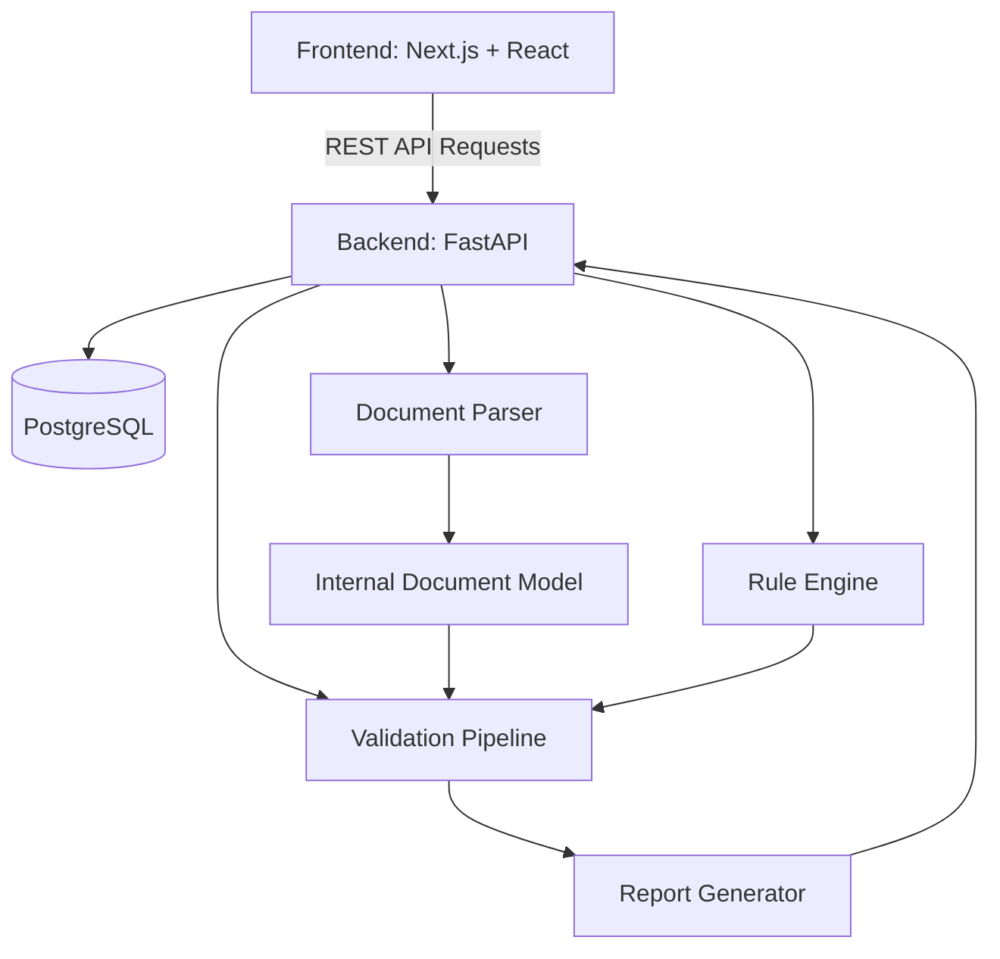
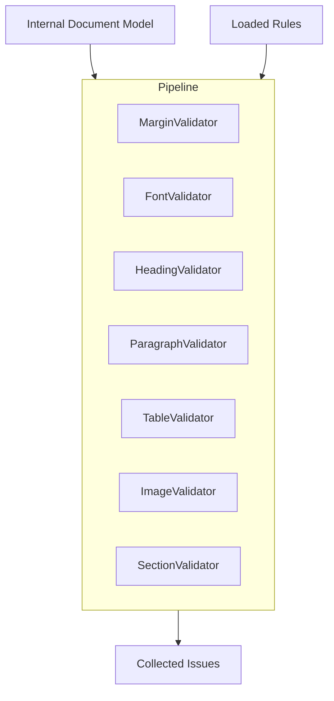
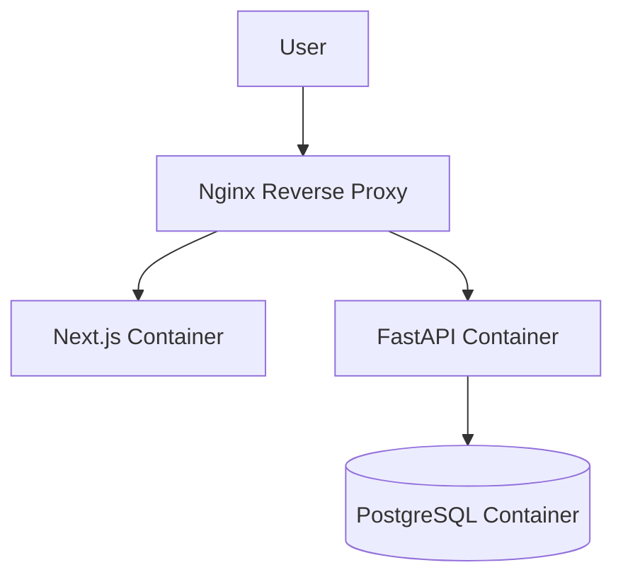

# Architecture Design

This document outlines the high-level architecture of the Document Compliance Platform, designed for modularity, extensibility, and enterprise-grade scalability.

## High-Level Architecture

The system operates on a client-server model, utilizing a decoupled architecture to ensure that the frontend interface, backend API, document parser, rule engine, and validation engine can evolve independently.

## Request Flow

1. **Upload**: User uploads a document via the Frontend.
2. **Parsing**: The API stores the document temporarily and passes it to the Document Parser.
3. **Modeling**: The Parser extracts all document elements (sections, paragraphs, runs, images, tables) into a structured Internal Document Model.
4. **Rule Loading**: The API loads the requested Rule Template via the Rule Engine.
5. **Validation**: The Internal Model and Rule Template are fed into the Validation Pipeline.
6. **Reporting**: The Validation Pipeline runs sequentially across all specific validators, collects issues, and triggers the Report Generator.
7. **Response**: The API returns the compliance score, summary, and issue timeline to the Frontend.

## Validation Pipeline

The Validation Pipeline uses the Chain of Responsibility / Strategy pattern. It takes an Internal Document Model and rules, distributing validation tasks to specialized components.

## Rule Engine Architecture

The Rule Engine is responsible for ingesting, validating, and versioning rules.
- **Format**: JSON/YAML.
- **Validation**: Rules are strictly validated using Pydantic schemas before they are saved to the database.
- **Templates**: Users can save rule sets as Reusable Templates, allowing quick application across multiple documents.

## Parser Architecture

The Document Parser abstraction isolates the underlying libraries (e.g., `python-docx`) from the rest of the application.
- Reads raw binary streams.
- Converts proprietary structures into a standardized generic Internal Document Model.
- Exposes common properties (e.g., bold, italic, margins) regardless of the source document type.

## Frontend Architecture

- **Framework**: Next.js 15 (App Router).
- **State Management**: React Query for server state (caching, background updates), React Context/Zustand for minimal local state.
- **UI Components**: shadcn/ui and TailwindCSS for a strict design system.
- **Routing**: Protected routes for authenticated users; dynamic routes for report viewing.

## Backend Architecture

- **Framework**: FastAPI for high concurrency using Python 3.12 asynchronous paradigms.
- **Validation**: Pydantic v2 ensures strict typing and serialization for all API inputs/outputs.
- **Service Layer**: Business logic (parsing, validating) is isolated from API routing.
- **Tasks**: Long-running validations (e.g., 500+ page docs) may be offloaded to background tasks via Celery/Redis in future phases.

## Database Architecture

- **RDBMS**: PostgreSQL.
- **ORM**: SQLAlchemy.
- **Migrations**: Alembic.
- **Schema Separation**: Tables are separated by domain: Users, Rule Templates, Documents (metadata only), and Validation Reports.

## Deployment Architecture

The application is containerized using Docker and Docker Compose.

## Future Plugin Architecture

The validation pipeline and parser are designed via interfaces (Abstract Base Classes in Python) to allow future integrations:
- **PDF Plugin**: A new `PDFParser` implementing the Parser interface using PyMuPDF without affecting the Validation Pipeline.
- **AI Plugins**: New Validators (e.g., `GrammarValidator`, `CitationValidator`) can be plugged into the Validation Pipeline seamlessly.
